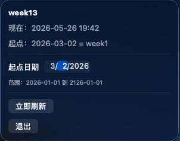
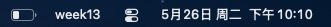
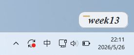
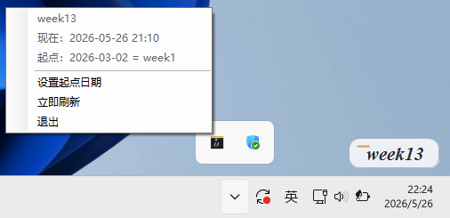
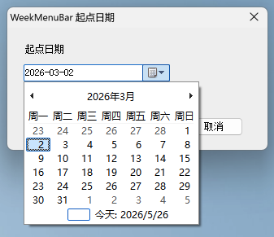

# WeekBar

**中文**：一个轻量的周数显示工具，支持 macOS 菜单栏与 Windows 任务栏角落显示。  
**English**: A lightweight week indicator for the macOS menu bar and the Windows taskbar corner.
#### 联系方式：A3257419881@gmail.com

---
[📘 查看 WeekBar 完整使用指南（交互式页面）](https://zhang-jincheng.github.io/WeekBar/)
---

## 功能 / Features

- 显示当前周数，并支持自定义起点日期  
  Show the current week number with a configurable start date

- 自动记住起点日期  
  Persist the selected start date automatically

- 每周一跨 0 点自动刷新  
  Refresh automatically after midnight

- macOS：菜单栏常驻  
  macOS: stays in the menu bar

- Windows：显示在任务栏时间区域附近的轻量悬浮条  
  Windows: a lightweight floating label shown near the taskbar clock area

---

## 效果展示 / Screenshots

### macOS

### Windows

---

## 下载 / Download

请前往 [Releases](https://github.com/zhang-jincheng/WeekBar/releases) 页面获取安装包。  
Download the installers from the [Releases](https://github.com/zhang-jincheng/WeekBar/releases) page.

- **macOS**: `WeekMenuBar-1.1.0.pkg`
- **Windows**: `WeekMenuBar-Setup-1.1.0.exe`

---

## 使用说明 / User Guide

### 中文

#### macOS

1. 下载 `WeekMenuBar-1.1.0.pkg`
2. 双击安装
3. 打开应用后，它会常驻在菜单栏中
4. 点击菜单栏项目可以查看当前周数并修改起点日期

#### Windows

1. 下载 `WeekMenuBar-Setup-1.1.0.exe`
2. 双击安装
3. 安装完成后，程序会显示在任务栏右下角时间区域附近
4. 托盘图标可用于设置起点日期、刷新和退出

#### 周数计算规则

- 你设置的起点日期会被视为 `week1` 的第一天
- 允许设置范围：`2026-01-01` 到 `2126-01-01`
- 如果当前日期早于起点日期，则会显示 `before week1`

### English

#### macOS

1. Download `WeekMenuBar-1.1.0.pkg`
2. Double-click to install
3. After launch, the app stays in the menu bar
4. Click the menu bar item to view the current week and change the start date

#### Windows

1. Download `WeekMenuBar-Setup-1.1.0.exe`
2. Run the installer
3. After installation, the app appears near the taskbar clock area
4. The tray icon can be used to change the start date, refresh, or quit

#### Week calculation rules

- Your selected start date is treated as the first day of `week1`
- Allowed date range: `2026-01-01` to `2126-01-01`
- If the current date is earlier than the start date, the app shows `before week1`

---

## 注意事项 / Notes

### 中文
当前版本未签名，macOS 或 Windows 可能会弹出系统安全提示
Windows 版本可能被浏览器或 Defender 识别为“不常见文件”或风险文件，这通常和未签名、下载信誉不足有关，并不等于程序本身是病毒
Windows 建议通过安装器安装后运行，不建议直接从共享目录或临时目录启动
Windows 版本的悬浮显示不是系统时钟原生控件，而是贴近任务栏时间区域的轻量显示层

### English
Current builds are unsigned, so macOS or Windows may show security warnings
On Windows, browsers or Defender may flag the installer as an uncommon or risky file because it is unsigned and has no download reputation; this does not automatically mean the app is malicious
On Windows, install first and run from the local user directory instead of directly from shared or temporary folders
The Windows floating label is not a native clock component; it is a lightweight display layer positioned near the taskbar clock area

